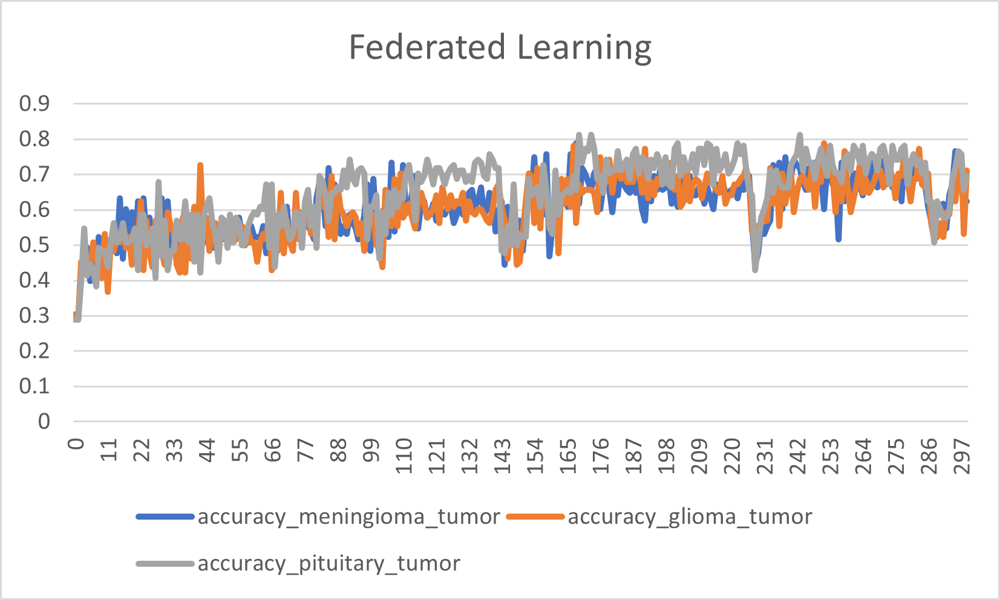

# 聯邦學習  Pytorch

## 內容
- [介紹](#介紹)
- [作品概述](#作品概述)
- [步驟](#步驟)
- [總結](#總結)
- [參考資料](#參考資料)

## 介紹
> 此為111學年度北護大專生畢業專題代碼呈現，我們組專題主題為聯邦學習，
> 我們組別會以聯邦學習的方式去模擬在AI沒有某病徵的醫療影像時，
> 是否能只以參數分享達到直接分享醫療影像的效果，使用參數分享方式為`fedavg`。

## 作品概述
> 此作品為第二版，與第一版相較之下將聯邦學習重要的三環節(訓練、交換、測試)各自獨立為函式，在醫療影像事先處理過的情況下
> 準確度依舊介於70~80%的區間，近期也會持續更新第三版，會以遷移學習的方式引進預處理模型來測試效果。

## 步驟
> 1. 引入資料集圖片(.p)。
> 2. 確認資料集中病徵種類，
>    |Type|glioma_tumor|meningioma_tumor|no_tumor|pituitary_tumor|
> 3. 應用部分 [Federated Learning](pytorch_federal_learning_腦部腫瘤辨識_pytorch.ipynb)
>    1. 建置pytorch模型
>    2. 定義訓練以及測試函式
>    3. 在 Early-stopping 作微調
>       - |超參數||
>         |:-|-:|
>         |學習率|`0.001`|
>         |批量大小|`64`|
>         |訓練輪次|`80`|
>       - |Loss Function|Optimizer|
>         |:-:|:-:|
>         |`SmoothL1Loss`|`Adam`|
>    4. 定義交換參數方式`fedavg`
>    5. 訓練過程中損失值以及準確率變化表
>         

- [Federated Learning 測試結果](result/fedavgmodel_bs64_train80_exchange300_dropout1_fc2_test3_SmoothL1Loss_mean.csv)

## 總結
> - 準確率上分享參數的方式需要適當的防止擬合，以防止某些特徵被放大。
> - `fedavg`的方式確實能使原本無法辨識A病徵的模型，增加辨識的多樣性。
> - 準確度相較直接分享醫療影像算差強人意，日後也會實驗以遷移學習的方式導入更優秀的卷積神經網路，
> 做測試
> - 卷積神經網路與全連接層中間參數上的計算與聯邦學習在影像辨識上的準確率有著高度正相關，
    > 例:卷積層中dropout在作品中防止擬合是不可少的。
> - 需先將醫療影像篩選過才可使用。
- 此作品在測量模型仍有不嚴謹之處，僅供參考，日後也會繼續以其他方式改進聯邦學習的卷積神經。

## 參考資料
> - [1] H. Brendan McMahan, Eider Moore, Daniel Ramage, Seth Hampson, Blaise Agüera y Arcas[Communication-Efficient Learning of Deep Networks from Decentralized Data](https://arxiv.org/abs/1602.05629).
> - [2] [How Federated Learning Could Transform Healthcare](https://builtin.com/machine-learning/federated-learning).
